## Indexes in Databases: RDBMS Edition


Let's say you want to store the data of 100 students in a diary. You can do it in 2 ways :

- write down all the data in a diary in random order
- write down all the data in a diary in sorted order according to roll number
- write down all the data in a diary in sorted order and place bookmarks at a different place to search too quickly look up any roll number


Now everyone will use the third method. But placing bookmarks will speed up the process of searching will scale out well even if we have a million records. So lets talk about Indexes in Database….

## What is a Database index

A database index is a data structure that improves the speed of data retrieval operations on a database table at the cost of additional writes and storage space to maintain the index data structure.

An index is a copy of selected columns of data, from a table, that is designed to enable very efficient search. An index normally includes a "key" or direct link to the original row of data from which it was copied, to allow the complete row to be retrieved efficiently.


### Example One : 
We have a simple table having id as integer, no fancy primary key or index. Then when we perform a query 
```sql
    select * from mock data where id = 99
```

It will performs a sequential scan, scanning meaning it will literally go through each and every row in the table to find out who has id 99 . We can take a look at the query plan using the `explain analyze` command. It's an extremely inefficient query as it going through all the rows in the table just to filter out the valid one

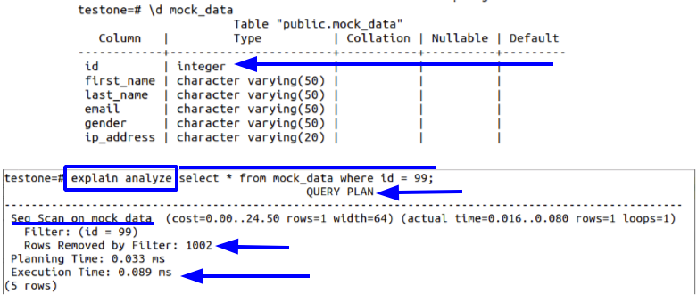

Next we have another table, same schema and data, but we create the id the primary key of our table. If we look at the description of the table, we see the primary key is an index. Also we see it is constructed using b tree data structure. Running the same query
```sql
    select * from mockdata where id = 998;
```

Instead of performing a sequential scanning and going through all the rows in database, we perform index to find out the exact row/rows we need matching the condition. Also notice the performing an index scan is much faster.

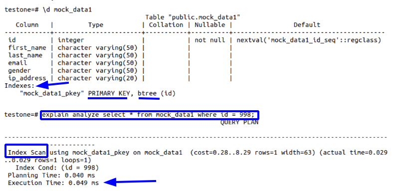

**Going back to the definition**
A database index is a data structure (in our case a b tree) that improves the speed of data retrieval operations (from 0.089ms to 0.049ms) on a database table at the cost of additional writes and storage space to maintain the index data structure.


### Types of indexes :

- B Trees
- B+ Trees
- Bit Map Index : take a look at the following  im to understand
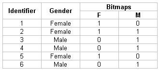
    - When we know that the cardinality of rows in finite (example gender column)

- Dense Index : 
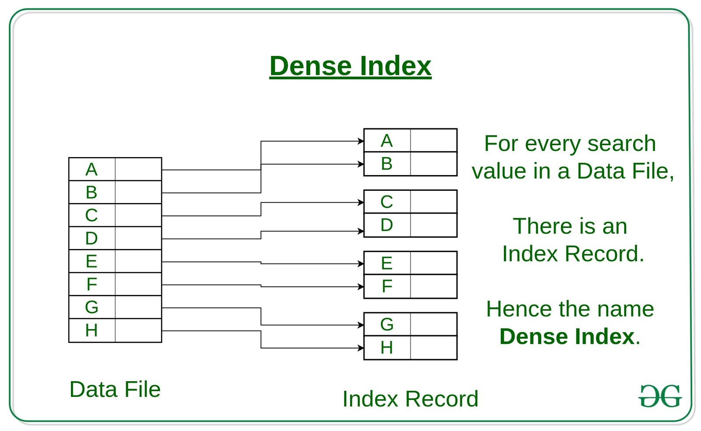

- Sparse Index :
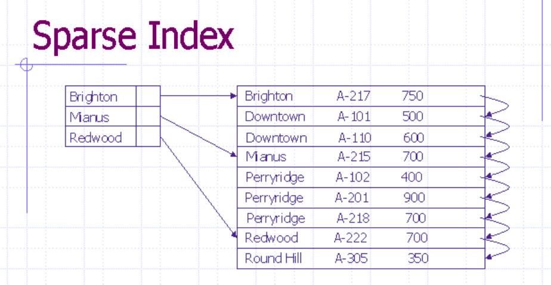

    - Instead of storing every row in index, we sort the table and store marker at different position. Then in order to find a row, we can decide within which two markers our data will exist.

Going back to the definition of database index
An index is a copy of selected columns of data, from a table, that is designed to enable very efficient search. An index normally includes a "key" or direct link to the original row of data from which it was copied, to allow the complete row to be retrieved efficiently.

### How to create an index
```sql
    create index if not exists [Index Name] on [Table Name]([Column Name]);
```

Example Queries

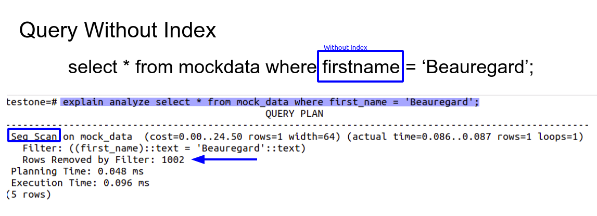

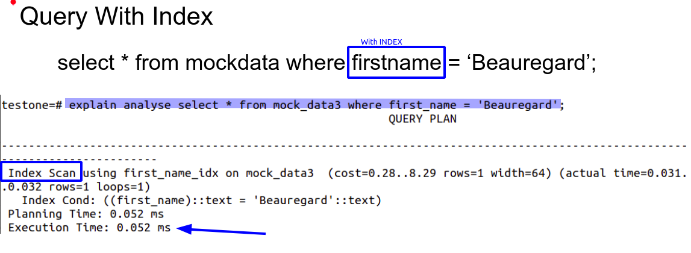


Interestingly, we you have a find on a column and you run a query performing pattern match, it wont use the index to search for it

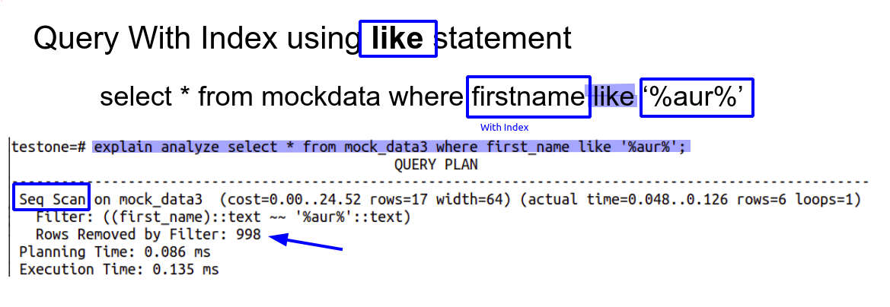


but

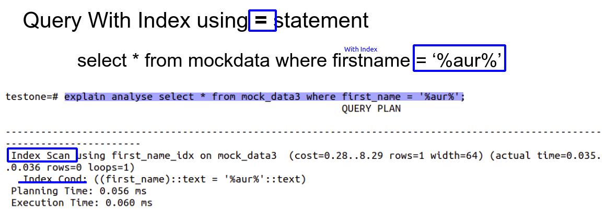


using the `=` operator to perform a pattern match, the database will use the index ,, WOW !


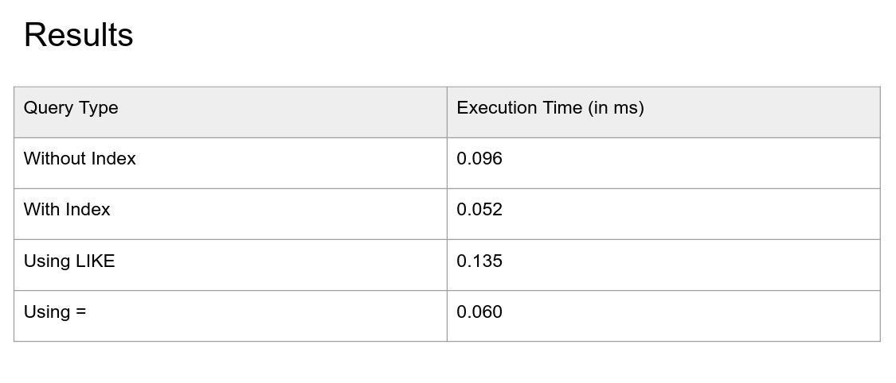

Indexes are cool, they make everything fast ?

Only when you are talking about performing read operations, but what about write, update or delete ?


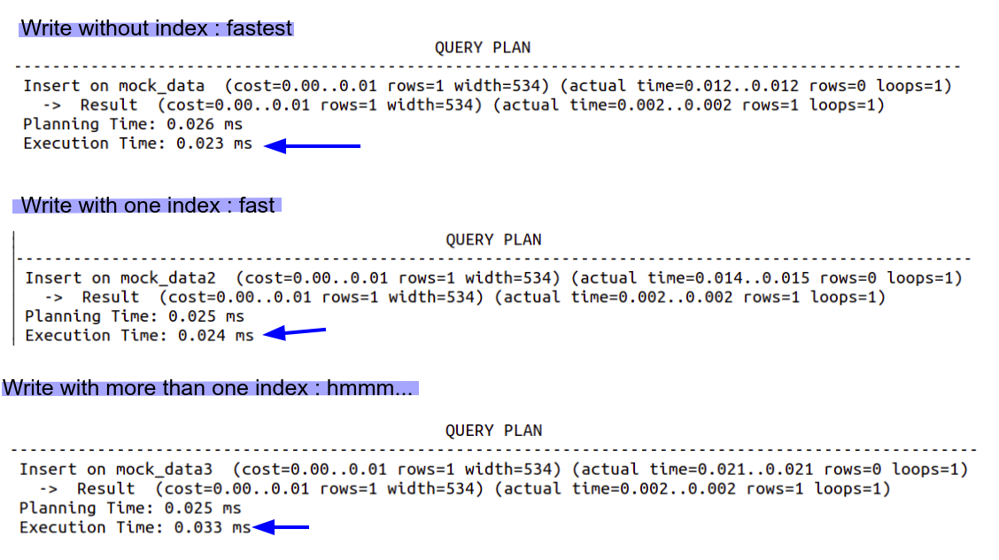


Because the database knows the end of the table, insert a row at the end it a super simple task
But with one index, after insert the data, the database will have to update the index data structure. If we add more indexes and update the more data, the execution time will be higher

Also some operations could be faster than others. in case the a tree based or sorted indexes, some additional operations needs to take place in order to balance/sort them in correct order. It could be easy if the balance is slightly disturbed or difficult if a lot of restructuring needs to take place

### How does database engine decides with index type to use ?

By default, PostgreSQL uses b trees to create index, but you can explicitly mention in the SQL query which type of index you want. For example, in case of storing gender data, because the carnality is finite you can specify to use bitmap index to optimise.

But sometimes, database engines are smart and the optimise type of index created on the table according to the data stored
```sql
    CREATE BITMAP INDEX ON MOCK_DATA2 (gender);
```

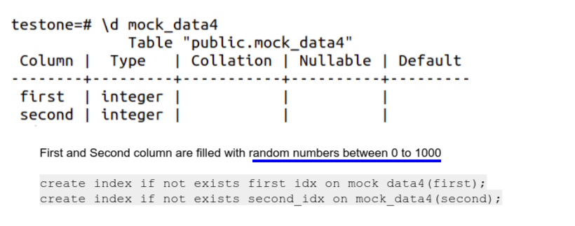


As discussed above, we can see below that instead of creating a b tree index, it created a BitMap index, proving the point that database can optimise the index based on data.

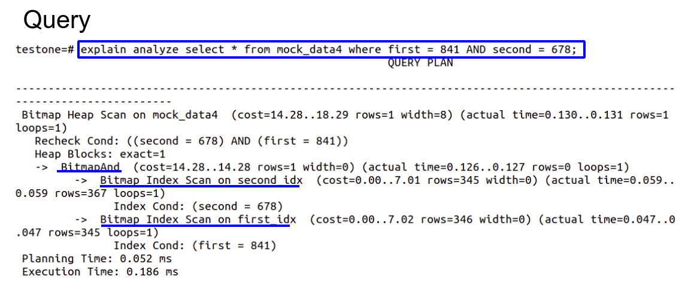

Composite Indexes
```sql    
create index on mock_data4(first,second);
```

Instead of creating two different index, we can create a composite index. Similar to the concept of composite key, a composite index is created using two or more columns and it is much faster to use.

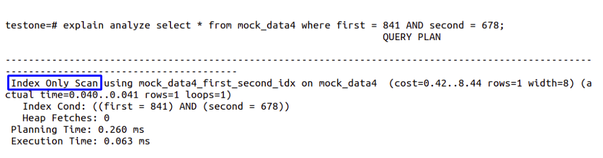


Also we can noticed that if we have create a composite index, and if we run a query using only column, it wont use the index.

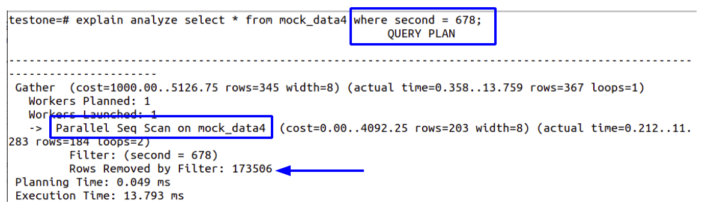


Composite Index can be faster to use compared to two different indexes.

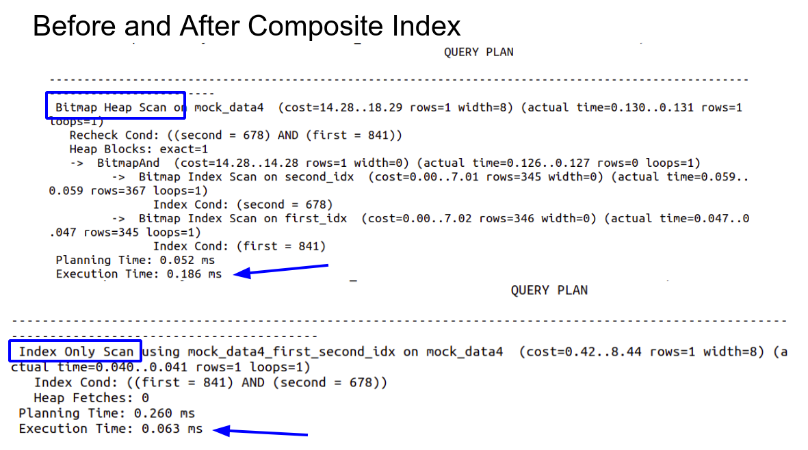

### Problems With Indexes
- Creating too many indexes can cause unnecessary lookup

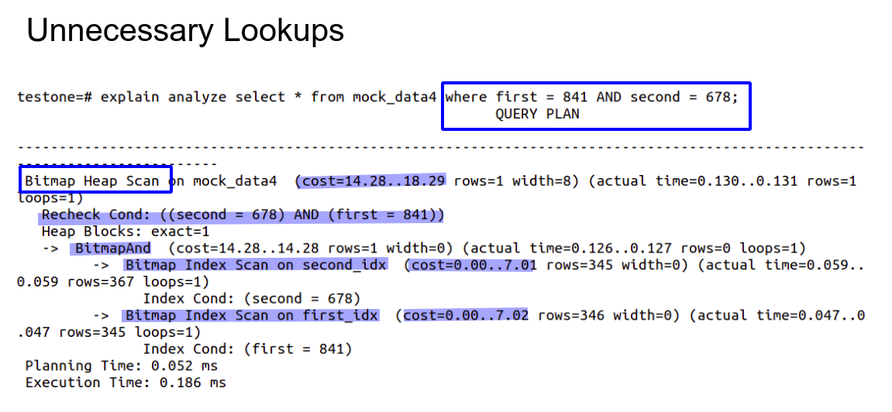

- Columns with indexes that are updated frequently also needs to update the index data structure and thus can consume more resources in background
- In-frequently used indexes consumes disk spaces
- Restoring Database from backup may take some time to re-create indexes, and you start running queries immediately, you may slow down your system which slows down the process and creating indexes and  ….


# With Great Power Comes Great Responsibilities 
