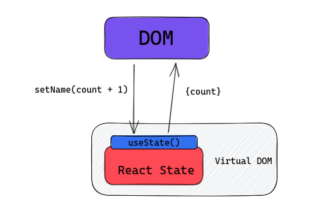
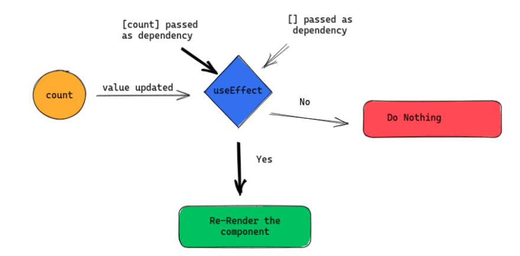
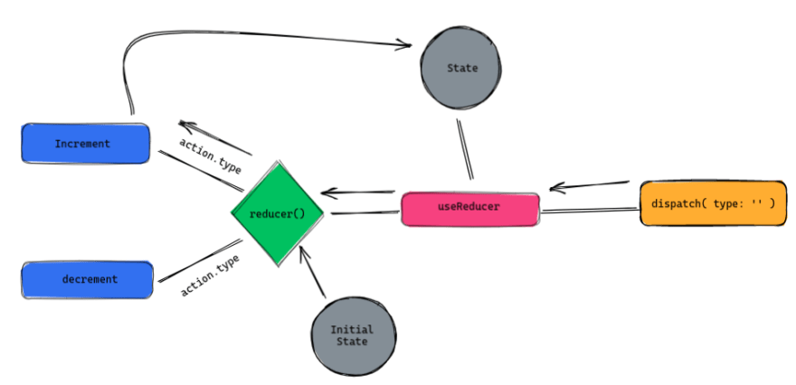
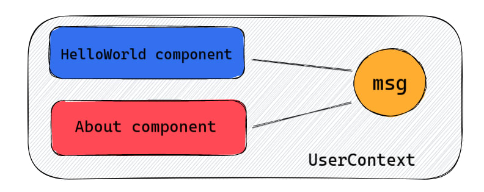

# React Hooks for beginners

## What are Hooks

React hooks are like Anchor ( same as what ships drop in the ocean to attach the ship and ocean floor) between React state (ocean floor) and life-cycle features ( ship ) of functional components.

- Only work with function based components, not with class based components.
- Both arrow and regular function component works
- Cannot nest hooks inside loops, conditions or nested functions

## `useState()`

`useState` hook provides you with functionality to set state for a variable and automatically update the DOM with the new state




### how to import :

```jsx
import React, {useState} from "react";
// or 
React.useState;
```

### example `useState`

```jsx
import React, { useState } from 'react'

let count1 = 0;

function App() {

  const [count, setCount] = useState(0);

  let count2 = 0;

  return (
    <div className='container mt-3'>
      <h3>Hello World to React Hooks</h3>

      <h4>Count : {count}</h4>
      <h4>Count1 : {count1}</h4>
      <h4>Count2 : {count2}</h4>

      <button className='btn btn-info' onClick={() => {
        setCount(count + 1);
        
        console.log(`count : ${count} | count1 : ${count1}  count2 :${count2}`);

        count1 = count1 + 1;
        count2 = count2 + 1;
      }} >Add here</button>
    </div>
  )
}

export default App
```


In this code snippet, `count` and `count1` will be updated both as variable as well in `DOM`. But `count2` will always be 1 (because of +1 operation in  `button.onClick` ) as whenever any data is changed in a react component, the whole component is re rendered. This is the reason why components exists.

Now you may ask, we can declare variables in global state and not use `useState`. Well declaring global variables in all programming languages are considered as bad practice except for some cases. Refer :

- [https://www.tutorialspoint.com/why-are-global-variables-bad-in-c-cplusplus](https://www.tutorialspoint.com/why-are-global-variables-bad-in-c-cplusplus)
- [https://dev.to/mervinsv/why-global-variables-are-bad-4pj](https://dev.to/mervinsv/why-global-variables-are-bad-4pj)

`useState` provides a consistent state without even if the component re renders.

### `useState` for objects

```jsx
import React, { useState } from 'react'

function App() {

  const [{ counter1, counter2 }, setCounter] = useState({ counter1: 0, counter2: 20 })

  return (
    <div className='container mt-3'>
      <div className='container'>

        <h3>Counter1 : {counter1}</h3>
        <h3>Counter2 : {counter2}</h3>

{/* this doesnt not work becuz whenever you update state, you need to update the whole object */}
{/* Over here, we havent included the counter2 in the setCounter function. */}

        <button className="btn btn-primary" onClick={() =>
          setCounter(currentState => ({ counter1: currentState.counter1 + 1 }))}>Add</button> &nbsp;

{/* this will also not work because spread operator in objects comes first 
    unlike in functions, where spread operator comes last. */}

{/* Correct Code */}
				<button className="btn btn-danger" onClick={() => setCounter(currentState => ({
          ...currentState,          
          counter1: currentState.counter1 - 1,
        }))}>Subtract</button

      </div>
    </div>
  )
}

export default App;
```

### Another Example `useState()`

```jsx
import React, { useState } from "react";

function App() {

  const [name, setName] = useState(localStorage.getItem("name") || "");

  return (
    <div className="App">

      <div className="container mt-3">
        <input name="name" value={name} onChange={e => {
          setName(e.target.value)
          localStorage.setItem("name", e.target.value)
        }} className='form-control' />

        <h3>Name : {name}</h3>
      </div>

    </div >
  );
}

export default App;
```

## `useEffect()`

- executes every time a component is rendered
- `useEffect` when passed no dependency works as `componentDidMount`
- return arrow function from `useEffect` is a clean up function
- many `useEffect` hook can co exists in one component

```jsx
import React, { useState, useEffect } from "react";
import HelloWorld from "./component/HelloWorld";

function App() {

  const [count, setCount] = useState(0);
  const [showComp, setComp] = useState(false);

  useEffect(() => {
    console.log("Rendering ...")
  })

  return (
    <div className="App">

      <br />

      <div className='container mt-3'>
        <h3>Count : {count}</h3>
        <button className="btn btn-primary" onClick={() => setCount(count + 1)}>Add</button> &nbsp;
      </div>

      <br />

      <div className='container'>
        <button onClick={() => setComp(!showComp)} className="btn btn-info"> toggle </button>
        {showComp && <HelloWorld />}
      </div>

    </div >
  );
}

export default App;

// in src/component/HelloWorld.jsx

import React from 'react'

function HelloWorld() {
    return (
        <div className='container mt-3'>
            <h2>HelloWorld component</h2>
        </div>
    )
}

export default HelloWorld
```




Run the code and look at the console ... Doesn't matter whether you increment the counter or toggle the component, the whole component get re-render.

To Stop this, modify `useEffect` as following

```jsx
useEffect(() => {
    console.log("Rendering ...")
}, [])
```

Now the rendering will print on the console only when you refresh the page. Try modifying code as following

```jsx
useEffect(() => {
    console.log("Rendering ...")
}, [count])
```

Now the component will re render only when count is updated

This is what `useEffect` do, to only update / rendering the component when required. There is also a way to clean up the component. Try by modifying `HelloWorld.jsx`

```jsx
import React from 'react'

function HelloWorld() {
    
    React.useEffect(() => {
        console.log('HelloWorld')
        return () => {
            console.log('GoodByeWorld')
        }
    }, [])
    
    return (
        <div className='container mt-3'>
            <h2>HelloWorld component</h2>
        </div>
    )
}

export default HelloWorld

// and App.jsx

useEffect(() => {
    console.log("Rendering ...")
},[])
```

Now try to toggle switch, you the message with the component is loaded on `DOM` and when its `unmounting`. This works similiar to **`componentWillMount` and `componentWillUnmount`**

## `useRef`

When you simply wants to put some html element or react component to focus

Best try running this code

```jsx
import React, { useRef } from "react";

function App() {

  const inputRef = useRef();

  return (
    <div className="App">

      <div className="container mt-3">

        <input ref={inputRef} name="name" value={name} onChange={e => {
          setName(e.target.value)
          localStorage.setItem("name", e.target.value)
        }}
          className='form-control'
        />

        <br />

        <button onClick={() => {
          inputRef.current.focus();
        }} className="btn btn-success" >Get focus</button>

      </div>

    </div>
  );
}

export default App;
```


## `useReducer`

Diagram explains this hook the best



```jsx
import React, { useReducer } from "react";

function reducer(state, action) {
  switch (action.type) {
    case 'increment': return state + 1;
    case 'decrement': return state - 1;
    default: return state;
  }
}

function App() {

  const [count, dispatch] = useReducer(reducer, 0);

  return (
    <div className="App">

      <div className='container' >
        <h2> count : {count} </h2>
        <button onClick={() => dispatch({ type: 'increment' })} className='btn btn-primary' > increment </button>
        <button onClick={() => dispatch({ type: 'decrement' })} className='btn btn-danger' > increment </button>

      </div>

    </div >
  );
}

export default App;
```

## `useContext`

Diagram explains this hook the best





```jsx
// App.js
import React from 'react'
import HelloWorld from "./components/HelloWorld"
import About from './component/About'
import { UserContext } from './UserContext'

function App() {
  return (
    <div>
      <UserContext.Provider value='super man'>
        <HelloWorld />
      </UserContext.Provider>
    </div>
  )
}

export default App

// Hello World component

import React, { useContext } from 'react'
import { UserContext } from '../UserContext'

function HelloWorld() {

    const msg = useContext(UserContext);

    return (
        <div className='container mt-3'>
            <h3>HelloWorld component : {msg}</h3>
        </div>
    )
}

export default HelloWorld

// About component

import React, { useContext } from 'react'
import { UserContext } from '../UserContext'

function About() {

    const msg = useContext(UserContext);

    return (
        <div className='container mt-3'>
            <h3>About component : {msg}</h3>
        </div>
    )
}

export default About

// Usercontext.js 

import { createContext } from "react";

export const UserContext = createContext(null);
```

## `useMemo`

Memo or Memoization is when you remember the result on something instead of computing it again and again when needed (until not changed)

`useMemo` in react is used for functions that are expensive and we dont want them to run again and again. It is similar to `useEffect` hook but used more for functions, whereas useEffect is used as managing state in component lifecycle, even tho they are very similiar.

```jsx
import React from 'react'

function expensivePhoneFunc (product) {
  console.log("expensivePhoneFunc")
  return product[0];
}

function App() {

  let product = [{
    name: 'Phone XL',
    price: 100
  },
  {
    name: 'Phone Mini',
    price: 80
  },
  {
    name: 'Phone Standard',
    price: 60
  }]

  const [count , setCount] = React.useState(0);

  const expensivePhone = React.useMemo( () => {
    return expensivePhoneFunc(product);
  },[])

  return (
    <div className='container mt-3'>
      <h3>Product : {expensivePhone.name}</h3>
      <h4>Price : {expensivePhone.price}</h4>
      <br />
      <h3>Count : {count}</h3>
      <button className='btn btn-primary' onClick={() => setCount(count + 1)}>+</button>
    </div>
  )
}

export default App
```

## `useCallback`

It is the `useMemo` alternative but for functions, rather than the result returned from them. Instead of running the function again and again. Its is mostly used along with useMemo.

```jsx
import React, {useCallback} from 'react'
import HelloWorld from './component/HelloWorld'

function App() {

  const [count, setCount] = React.useState(0);

  const increment = useCallback(() => {
    setCount(c => c + 1);
  }, [setCount]);

  
  return (
    <div>
      <HelloWorld increment={increment} />
      <h3>Count : {count}</h3>
    </div>
  )
}

export default App

// HelloWorld.jsx

import React from 'react'

const HelloWorld = React.memo(({ increment }) => {

    console.log("hello")

    return (
        <div className='container mt-3'>
            <h3>HelloWorld component</h3>
            <button onClick={increment}>Hello World</button>
        </div>
    )
})

export default HelloWorld
```

---

